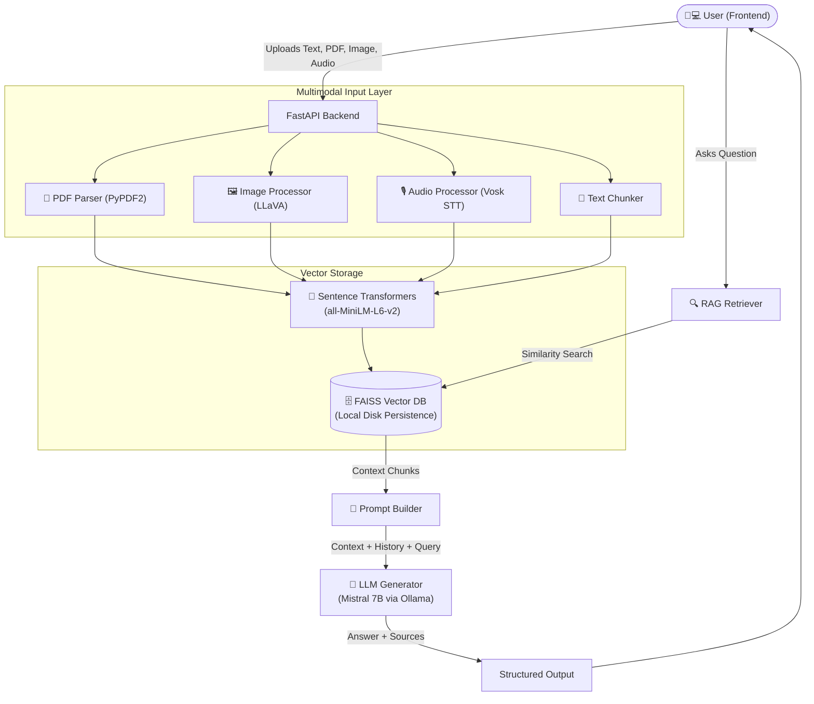
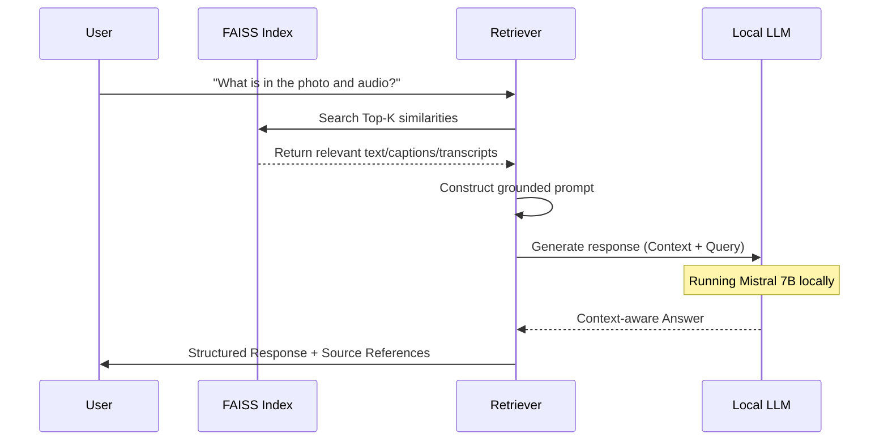

<div align="center">
  <h1>🤖 Offline Multimodal RAG Assistant</h1>
  <p><b>A fully offline, privacy-first AI system that accepts Text, PDF, Image, and Audio inputs</b></p>

  
  
  
  

  <br />
  <a href="https://drive.google.com/file/d/1AL5aEjYEW7x_Zm7uHAK_jWy4-w2Rh8bm/view?usp=sharing" target="_blank"></a>
  <br />
  <br />

  <p><i>An intelligent RAG system that performs semantic retrieval and generates grounded responses using local LLMs — running entirely on your machine with zero internet dependency.</i></p>

  <p>
    <a href="#-problem-statement">Problem</a> •
    <a href="#-the-solution">Solution</a> •
    <a href="#%EF%B8%8F-architecture">Architecture</a> •
    <a href="#-key-features">Features</a> •
    <a href="#-quick-start">Quick Start</a> •
    <a href="#-impact--benefits">Impact</a> •
    <a href="https://github.com/AabirManik/Mulimodal-Rag" target="_blank">Repository & Demo</a>
  </p>
</div>

---

## 📖 What is Offline Multimodal RAG?

In an era where every AI tool sends your data to the cloud, privacy and security have become major concerns for developers and enterprises alike. When you need to query sensitive PDFs, analyze private images, or transcribe confidential audio recordings, relying on cloud-based LLMs is often a non-starter.

**Offline Multimodal RAG Assistant** is a fully localized AI ecosystem that ingests multiple data modalities, performs advanced vector similarity search, and generates highly accurate, context-aware answers using open-source models like Mistral and LLaVA. It does all of this locally, securely, and seamlessly.

---

## 🚨 Problem Statement

| The Privacy & Connectivity Crisis |
| --- |

1. **Data Privacy Risks:** Cloud-based AI systems require uploading sensitive documents, images, and audio, exposing confidential data to third-party servers.
2. **Connectivity Dependency:** Most robust RAG solutions fail instantly without a high-speed internet connection, making them useless in air-gapped or remote environments.
3. **Siloed Modalities:** Tools typically handle either text OR images OR audio. Processing a comprehensive dataset requires stitching together fragmented tools.
4. **Subscription Fatigue:** Cloud LLMs and API providers charge recurring fees or per-token costs, making continuous usage expensive.

*Result: Compromised privacy, restricted usage environments, fragmented workflows, and uncontrolled recurring costs.*

---

## 🎯 Objective

Build an **end-to-end, privacy-first AI platform** that:
- Runs 100% offline on consumer or enterprise hardware.
- Seamlessly handles text, PDF documents, images, and audio natively.
- Performs semantic retrieval using localized vector stores (FAISS).
- Generates intelligent, grounded responses using state-of-the-art open models (Mistral, LLaVA).
- Offers a modern, beautiful Neobrutalist UI for intuitive interactions.

**➡️ Goal:** Deliver enterprise-grade multimodal AI assistance with zero data leakage and zero internet dependency.

---

## 💡 The Solution

**Offline Multimodal RAG Assistant** combines **local inference**, **multi-format ingestion**, **semantic vector search**, and **offline speech-to-text** into one cohesive platform:

1. **🔒 Zero Data Leakage:** All operations—from document parsing to image captioning to text generation—occur strictly on localhost. No API calls, no telemetry.
2. **🧩 Multimodal Ingestion Pipeline:** Accepts PDFs (PyPDF2), Images (LLaVA), Audio (Vosk), and plain text in a unified processing pipeline.
3. **🧠 Local Vector Storage:** Utilizes Sentence Transformers for high-quality embeddings and FAISS for rapid, on-disk semantic search.
4. **🎨 Neobrutalist UI/UX:** A striking, highly responsive React frontend featuring dark mode aesthetics and instant visual feedback.
5. **🤖 Local LLM Orchestration:** Powered by Ollama for frictionless deployment of models like Mistral 7B and LLaVA.

---

## 🏗️ Architecture

### System Flow



### Data Flow for a Single Query



---

## 🔥 Key Features

- 🔒 **100% Offline & Private**
  - Zero internet calls during operation.
  - No telemetry, no tracking, data never leaves your machine.

- 🧩 **True Multimodal Support**
  - **PDFs:** Advanced text extraction and intelligent chunking.
  - **Images:** Local image captioning and reasoning via LLaVA.
  - **Audio:** Offline speech-to-text transcription using Vosk and FFmpeg.

- 🧠 **Smart Context Retrieval (RAG)**
  - Utilizes `all-MiniLM-L6-v2` for dense vector embeddings.
  - FAISS integration for sub-millisecond similarity search.
  - Maintains multi-turn conversation memory (Session history).

- 🎨 **Neobrutalism Design System**
  - Space Grotesk & JetBrains Mono typography.
  - High-contrast UI with `#00FFAA` accents on an `#0A0A0A` dark canvas.
  - Smooth animations via Framer Motion and state management via Zustand.

---

## 👥 Target Users

| User | Main Need | Key Feature |
| --- | --- | --- |
| **Enterprise Teams** | Querying internal confidential docs | 100% Offline & Private |
| **Researchers** | Analyzing massive PDF datasets | Local FAISS Vector Search |
| **Content Creators** | Searching through audio/video transcripts | Vosk Audio Processing |
| **Privacy Advocates** | Using AI without data harvesting | Zero Telemetry / Localhost |
| **Data Scientists** | Testing RAG architectures locally | Modular FastAPI Backend |

---

## 🧠 All Uses of AI within Multimodal RAG

1. **Text Generation & Reasoning:** Uses **Mistral 7B** (via Ollama) to synthesize answers grounded exclusively in the retrieved context.
2. **Visual Comprehension:** Uses **LLaVA** to automatically analyze and caption uploaded images, converting visual data into searchable text.
3. **Semantic Embeddings:** Uses **Sentence Transformers (`all-MiniLM-L6-v2`)** to convert text, transcripts, and image captions into dense vector representations.
4. **Speech Recognition:** Uses the **Vosk AI Model** to convert raw audio inputs into accurate text transcripts without cloud APIs.

---

## 🌟 Innovation Points

* **Unified Modality Processing:** Instead of separate tools for audio transcription, image OCR, and PDF parsing, everything is normalized into a single semantic vector space.
* **Air-Gapped Reliability:** Purpose-built to function in environments with zero network connectivity.
* **Zero Recurring Costs:** By leveraging open-weight models (Mistral, LLaVA) and local hardware, the per-query cost drops to absolutely $0.

---

## ⚖️ Existing Solutions vs. Offline Multimodal RAG

**Comparison Matrix**

| Feature | ChatGPT Plus | Claude 3 | Standard Local RAG | This Project |
| --- | :---: | :---: | :---: | :---: |
| 100% Offline / Private | ❌ | ❌ | ✅ | ✅ |
| PDF Parsing | ✅ | ✅ | ✅ | ✅ |
| Image Analysis | ✅ | ✅ | ❌ | ✅ Local LLaVA |
| Audio Ingestion | ✅ | ❌ | ❌ | ✅ Local Vosk |
| Free / No API Costs | ❌ Paid | ❌ Paid | ✅ | ✅ |
| Open Source Stack | ❌ | ❌ | ✅ | ✅ |

---

## 💡 Impact & Benefits

| Metric | Improvement | Description |
| --- | --- | --- |
| **Data Privacy** | `100%` | Zero bytes of data transmitted to external servers. |
| **Operating Cost** | `$0.00` | No API tokens, no monthly subscriptions needed. |
| **Context Switching** | `↓ 80%` | One unified interface for PDFs, Images, and Audio. |
| **Response Latency** | `Fast` | Avoids internet round-trips; bounded only by local GPU/CPU. |

---

## 🔧 Technical Stack

| Layer | Technologies |
| --- | --- |
| **Frontend UI** | React, Vite, TailwindCSS v4, Framer Motion |
| **State Management** | Zustand |
| **Backend API** | Python, FastAPI, Uvicorn |
| **LLM Engine** | Mistral 7B & LLaVA (via Ollama) |
| **Embeddings** | Sentence Transformers (`all-MiniLM-L6-v2`) |
| **Vector DB** | FAISS (Local Disk) |
| **Speech-to-Text** | Vosk (offline), FFmpeg |
| **PDF Parsing** | PyPDF2 |

---

## 🚀 Quick Start

### ⚡ Prerequisites

1. **Python 3.10+** & **Node.js 18+**
2. **Ollama:** [Download](https://ollama.com/download) and run:
   ```bash
   ollama pull mistral
   ollama pull llava
   ollama serve
   ```
3. **Vosk Model:** Download the [small English model](https://alphacephei.com/vosk/models) to `backend/models/vosk-model-small-en-us-0.15/`.
4. **FFmpeg:** [Download](https://ffmpeg.org/download.html) and add to system PATH.

### ⚙️ Backend Setup
```bash
cd backend
python -m venv venv
# Windows: venv\Scripts\activate | Mac/Linux: source venv/bin/activate
pip install -r requirements.txt
python -m uvicorn backend.main:app --reload --port 8000
```

### 🎨 Frontend Setup
```bash
cd frontend
npm install
npm run dev
```
Open **http://localhost:5173** in your browser.

---

## 📂 Project Structure

```text
Rag_Model/
├── backend/
│   ├── main.py              # FastAPI entry point
│   ├── config.py            # Central configuration
│   ├── requirements.txt     # Python dependencies
│   ├── api/
│   │   └── routes.py        # API endpoints
│   ├── ingest/
│   │   ├── pdf_processor.py   # PDF text extraction + chunking
│   │   ├── image_processor.py # LLaVA image captioning
│   │   └── audio_processor.py # Vosk speech-to-text
│   ├── embeddings/
│   │   └── embedder.py      # Sentence Transformer embeddings
│   ├── vectorstore/
│   │   └── faiss_store.py   # FAISS index + metadata
│   ├── rag/
│   │   ├── retriever.py     # Similarity search
│   │   ├── prompt_builder.py # Grounded prompt construction
│   │   ├── generator.py     # Ollama LLM generation
│   │   └── pipeline.py      # Full RAG orchestration
│   └── data/                # Auto-created at runtime
│       ├── uploads/
│       ├── faiss_index/
│       └── sessions/
│
└── frontend/
    ├── index.html
    ├── vite.config.js
    ├── package.json
    └── src/
        ├── main.jsx
        ├── App.jsx
        ├── index.css          # Neobrutalism design system
        ├── api/
        │   └── client.js      # Axios API client
        ├── store/
        │   └── chatStore.js   # Zustand state management
        └── components/
            ├── Navbar.jsx
            ├── InitialView.jsx
            ├── Sidebar.jsx
            ├── ChatArea.jsx
            ├── MessageBubble.jsx
            ├── SourceCard.jsx
            ├── InputBar.jsx
            └── LoadingStates.jsx
```

---

## 📡 API Endpoints

| Method | Endpoint | Description |
|--------|----------|-------------|
| `GET` | `/api/health` | System health check |
| `POST` | `/api/ingest` | Upload & ingest file (PDF/image/audio) |
| `POST` | `/api/query` | Send query, get RAG response |
| `POST` | `/api/sessions` | Create new chat session |
| `GET` | `/api/sessions` | List all sessions |
| `GET` | `/api/sessions/{id}` | Get session with history |
| `DELETE` | `/api/sessions/{id}` | Delete a session |
| `GET` | `/api/vectorstore/stats` | Vector store statistics |
| `POST` | `/api/vectorstore/clear` | Clear all vectors |

---

## 🧪 Test Cases

### 1. PDF Query
```bash
# Ingest a PDF
curl -X POST http://localhost:8000/api/ingest \
  -F "file=@document.pdf" -F "modality=pdf"

# Query it
curl -X POST http://localhost:8000/api/query \
  -H "Content-Type: application/json" \
  -d '{"question": "What is the main topic of this document?"}'
```

### 2. Image Reasoning
```bash
curl -X POST http://localhost:8000/api/ingest \
  -F "file=@photo.jpg" -F "modality=image"

curl -X POST http://localhost:8000/api/query \
  -H "Content-Type: application/json" \
  -d '{"question": "Describe what was in the uploaded image."}'
```

### 3. Audio Query
```bash
curl -X POST http://localhost:8000/api/ingest \
  -F "file=@recording.wav" -F "modality=audio"

curl -X POST http://localhost:8000/api/query \
  -H "Content-Type: application/json" \
  -d '{"question": "What was discussed in the audio recording?"}'
```

### 4. Multi-turn Conversation
```bash
# Create session
curl -X POST http://localhost:8000/api/sessions

# Query with session (replace SESSION_ID)
curl -X POST http://localhost:8000/api/query \
  -H "Content-Type: application/json" \
  -d '{"question": "Tell me more about that.", "session_id": "SESSION_ID"}'
```

---

## 🎨 Design System (Neobrutalism)

| Token | Value | Usage |
|-------|-------|-------|
| Background | `#0A0A0A` | Page background |
| Card | `#111111` | Card surfaces |
| Accent | `#00FFAA` | Interactive elements |
| Border | `#FFFFFF` | 2.5px solid borders |
| Text | `#FFFFFF` | Primary text |
| Font Display | Space Grotesk | Headings, buttons |
| Font Mono | JetBrains Mono | Code, labels |
| Font Body | Inter | Body text |

---

## 🛣️ Roadmap

- [x] Local FAISS Vector Storage
- [x] Multimodal Ingestion (PDF, Text, Audio, Image)
- [x] LLaVA & Mistral Integration
- [x] Neobrutalist UI
- [ ] Multi-document cross-referencing
- [ ] Agentic fallback routing (auto-select model based on query)
- [ ] One-click Docker containerization
- [ ] Support for local Video ingestion

---

## 📄 License

MIT

<br />
<div align="center">
  <b>Built with ❤️ for privacy-conscious developers</b>
  <br />
  <sub>Offline Multimodal RAG Assistant — Because your data is yours.</sub>
</div>
